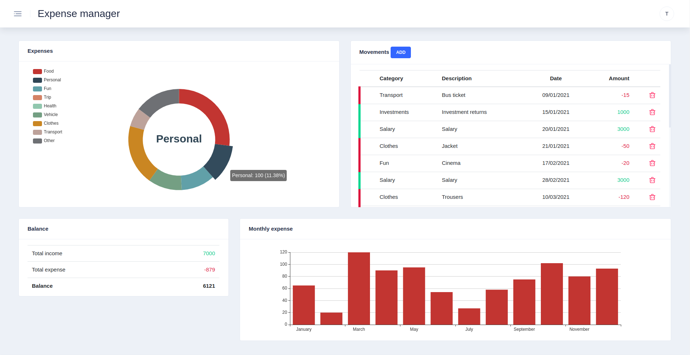

# Expense manager

Simple web application for managing expenses and incomes.

Written in Angular and using Firebase as backend.

## Screenshots



## Usage

Requisites:

- npm
- Angular 10.2

Usage:

```sh
$ git clone 

$ cd web

$ npm i

$ npm start
```
